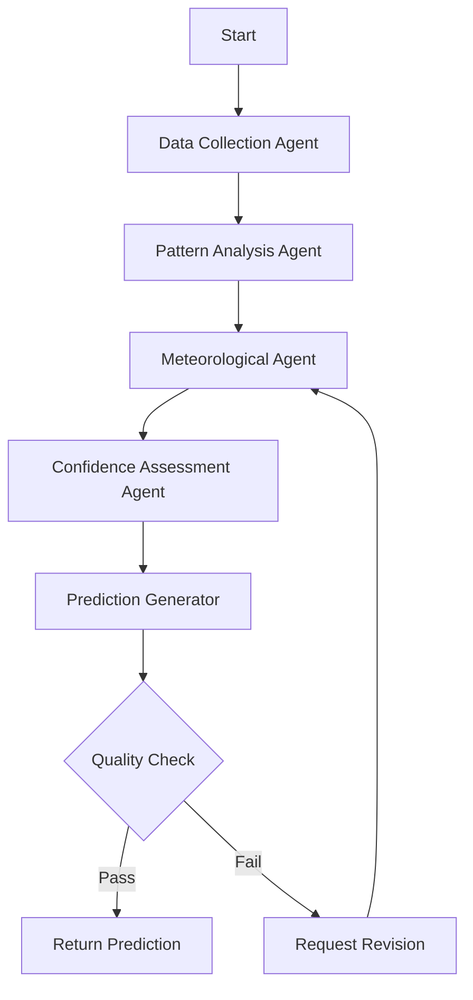

# LangGraph Multi-Agent Weather Prediction System

## Overview

This Flask application now implements a sophisticated multi-agent weather prediction system using LangGraph, a powerful framework for building complex AI workflows. LangGraph enables us to create specialized AI agents that work together to provide more accurate and reliable weather predictions than a single AI model alone.

## What is LangGraph?

LangGraph is a framework for building multi-agent AI systems where different specialized agents collaborate to solve complex problems. It uses a graph-based approach where:

- **Nodes** represent different AI agents or processing steps
- **Edges** define the flow of information between agents
- **State** maintains shared data across all agents
- **Conditional routing** allows intelligent decision-making about which agent to use next

## Why Use Multi-Agent Architecture for Weather Prediction?

Weather prediction is inherently complex and benefits from multiple specialized perspectives:

1. **Data Collection Agent**: Specializes in gathering and validating weather data
2. **Pattern Analysis Agent**: Expert at identifying weather patterns and trends
3. **Meteorological Agent**: Applies scientific meteorological principles
4. **Confidence Assessment Agent**: Evaluates prediction reliability
5. **Prediction Generator**: Synthesises all agent outputs into structured forecast day cards (3–14 days)

This approach provides:
- **Higher Accuracy**: Multiple specialized agents provide diverse insights
- **Better Reliability**: Quality control and confidence assessment
- **Explainability**: Clear reasoning chain from each agent
- **Fault Tolerance**: If one agent fails, others can still provide predictions

## System Architecture

```
┌─────────────────┐
│   User Request  │
└─────────────────┘
         │
         ▼
┌─────────────────┐    ┌──────────────────┐
│ Flask Route     │────│ LangGraph        │
│ /predict-       │    │ Weather Service  │
│ langgraph       │    └──────────────────┘
└─────────────────┘             │
         │                      ▼
         │              ┌──────────────────┐
         │              │ StateGraph       │
         │              │ Workflow         │
         │              └──────────────────┘
         │                      │
         ▼                      ▼
┌─────────────────┐    ┌──────────────────┐
│ Response with   │    │ 5 Specialized    │
│ Multi-Agent     │◄───│ Weather Agents   │
│ Prediction      │    └──────────────────┘
└─────────────────┘
```

## Agent Workflow

The LangGraph system follows this intelligent workflow:



## Implementation Details

### 1. State Management

The system uses a shared state structure that all agents can access and modify:

```python
class WeatherAnalysisState(TypedDict):
    location: str
    date: str
    weather_data: Dict[str, Any]
    analysis_results: List[Dict[str, Any]]
    confidence_scores: Dict[str, float]
    final_prediction: Dict[str, Any]
    quality_flags: List[str]
    messages: List[Any]
```

### 2. Specialized Agents

Each agent has a specific role and expertise:

#### Data Collection Agent
```python
def data_collection_agent(state: WeatherAnalysisState):
    """Gathers and validates weather data from multiple sources"""
    # Collects current conditions, historical patterns, satellite data
    # Validates data quality and completeness
    # Updates state with clean, structured weather data
```

#### Pattern Analysis Agent
```python
def pattern_analysis_agent(state: WeatherAnalysisState):
    """Identifies weather patterns and trends"""
    # Analyzes seasonal patterns, pressure systems, temperature trends
    # Identifies anomalies or unusual weather patterns
    # Provides pattern-based predictions
```

#### Meteorological Agent
```python
def meteorological_agent(state: WeatherAnalysisState):
    """Applies scientific meteorological principles"""
    # Uses atmospheric physics and meteorological models
    # Analyzes pressure gradients, wind patterns, moisture content
    # Provides scientifically-grounded predictions
```

#### Confidence Assessment Agent
```python
def confidence_assessment_agent(state: WeatherAnalysisState):
    """Evaluates prediction reliability"""
    # Calculates confidence scores for each prediction component
    # Identifies uncertainty sources and potential error factors
    # Provides reliability metrics
```

#### Prediction Generator
```python
def prediction_generator(state: WeatherAnalysisState):
    """Synthesises all agent outputs into structured forecast day cards"""
    # Combines outputs from all agents into final structured prediction
    # Generates N day objects with date, temperature, humidity, wind, conditions
    # Ensures exactly the requested number of day cards are returned
    # Applies Qwen3 CoT with scaled max_tokens and timeout per day count
```

### 3. Intelligent Routing

The system uses conditional logic to determine the next step:

```python
def should_continue(state: WeatherAnalysisState):
    """Determines if more analysis is needed or if we can provide final prediction"""
    quality_flags = state.get("quality_flags", [])
    confidence_scores = state.get("confidence_scores", {})
    
    # Continue if quality issues found or confidence too low
    if quality_flags or min(confidence_scores.values()) < 0.7:
        return "continue"
    else:
        return "end"
```

## API Integration

The LangGraph system integrates seamlessly with the existing Flask API:

### New Endpoints

#### `/api/weather/predict-langgraph`
```python
@bp.route('/predict-langgraph', methods=['POST'])
def predict_weather_langgraph():
    """Multi-agent weather prediction using LangGraph"""
    try:
        data = request.get_json()
        location = data.get('location')
        date = data.get('date')
        
        # Use multi-agent system for prediction
        result = weather_service.predict_weather_with_langgraph(location, date)
        
        return jsonify({
            'success': True,
            'prediction': result['prediction'],
            'confidence_scores': result['confidence_scores'],
            'agent_insights': result['analysis_results'],
            'quality_assessment': result['quality_flags']
        })
    except Exception as e:
        return jsonify({'success': False, 'error': str(e)}), 500
```

#### `/api/weather/langgraph-status`
```python
@bp.route('/langgraph-status', methods=['GET'])
def get_langgraph_status():
    """Check if LangGraph multi-agent system is available"""
    return jsonify({
        'langgraph_available': weather_service.get_langgraph_status(),
        'agent_count': 5,
        'workflow_type': 'multi_agent_weather_analysis'
    })
```

## Service Integration

The LangGraph service integrates with existing services:

```python
class LangGraphWeatherService:
    def __init__(self):
        # Initialize with existing services for enhanced capabilities
        from .weather_service import WeatherService
        from .rag_service import RAGService  
        from .langchain_service import LangChainService
        from .lm_studio_service import LMStudioService
        
        self.weather_service = WeatherService()
        self.rag_service = RAGService()
        self.langchain_service = LangChainService()
        self.lm_studio_service = LMStudioService()
```

## Benefits of This Implementation

### 1. Enhanced Accuracy
- Multiple expert perspectives on weather prediction
- Cross-validation between agents reduces errors
- Quality control ensures reliable outputs

### 2. Improved Reliability  
- Confidence scoring for each prediction component
- Graceful degradation if some agents fail
- Fallback to traditional prediction methods

### 3. Better Explainability
- Clear reasoning chain from each specialized agent
- Detailed confidence metrics and quality assessments
- Transparent decision-making process

### 4. Scalability
- Easy to add new specialized agents
- Modular architecture allows independent agent improvements
- Configurable workflow routing

## Usage Examples

### Basic Weather Prediction
```javascript
// Frontend request
const response = await fetch('/api/weather/predict-langgraph', {
    method: 'POST',
    headers: {'Content-Type': 'application/json'},
    body: JSON.stringify({
        location: 'Tokyo, Japan',
        date: '2024-01-15'
    })
});

const result = await response.json();
console.log(result.prediction);        // Final weather prediction
console.log(result.confidence_scores); // Confidence for each component
console.log(result.agent_insights);    // Insights from each agent
console.log(result.quality_assessment); // Quality control results
```

### Check System Status
```javascript
const status = await fetch('/api/weather/langgraph-status');
const statusData = await status.json();
console.log(statusData.langgraph_available); // true/false
console.log(statusData.agent_count);        // 5
```

## Error Handling and Fallbacks

The system includes robust error handling:

1. **LangGraph Unavailable**: Falls back to traditional prediction methods
2. **Individual Agent Failure**: Other agents continue processing
3. **Low Confidence**: Requests human validation or additional data
4. **Quality Control Failure**: Returns uncertainty indicators

## Future Enhancements

### Potential Additional Agents
- **Climate Change Agent**: Analyzes long-term climate patterns
- **Extreme Weather Agent**: Specializes in severe weather detection
- **Agricultural Agent**: Focuses on farming-relevant weather factors
- **Aviation Agent**: Specialized for flight weather conditions

### Advanced Features
- **Learning System**: Agents improve based on prediction accuracy
- **Real-time Data Integration**: Continuous data stream processing
- **Ensemble Predictions**: Multiple prediction scenarios with probabilities
- **Geographic Specialization**: Location-specific agent expertise

## Technical Requirements

### Dependencies
- `langgraph`: Multi-agent workflow framework
- `langsmith`: LangGraph tooling and monitoring
- `langchain-core`: Core LangChain functionality
- Existing Flask ecosystem (Flask, SQLAlchemy, etc.)

### Installation
```bash
# In the flasking virtual environment
pip install langgraph langsmith
```

### Environment Setup
The system automatically detects LangGraph availability and gracefully degrades if not installed:

```python
try:
    from langgraph.graph import StateGraph, END
    from langchain_core.messages import HumanMessage, AIMessage
    LANGGRAPH_AVAILABLE = True
except ImportError:
    LANGGRAPH_AVAILABLE = False
    # Falls back to traditional prediction methods
```

## Conclusion

The LangGraph multi-agent implementation transforms this Flask weather application into a sophisticated AI system that leverages the power of specialized agents working together. This approach provides more accurate, reliable, and explainable weather predictions while maintaining compatibility with the existing application architecture.

The system demonstrates how modern AI frameworks like LangGraph can enhance traditional applications by introducing collaborative intelligence, where multiple specialized AI agents work together to solve complex problems more effectively than any single model could alone.